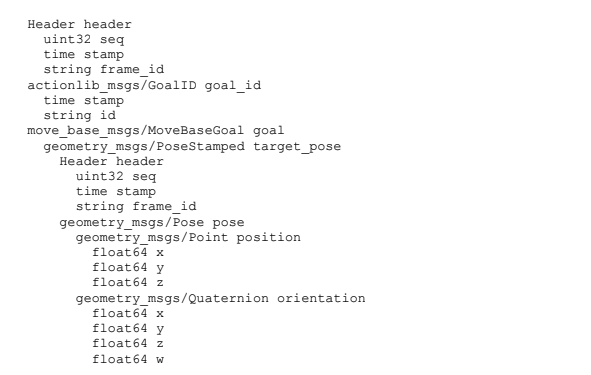

# 8.1.1 Определение целей навигации с помощью move\_base

Чтобы определить навигационную цель с помощью move\_base, мы предоставляем целевую позу \(положение и ориентацию\) робота относительно конкретной системы отсчета. Пакет move\_base использует тип сообщения MoveBaseActionGoal для указания цели. Чтобы увидеть определение этого типа сообщения, выполните команду:

**`$ rosmsg show MoveBaseActionGoal`**

что должно привести к следующему результату:

Как видите, цель состоит из стандартного заголовка ROS, включающего в себя frame\_id, goal\_id и саму цель, которая дается в виде сообщения SignedStamped. Тип сообщения [PoseStamped](https://docs.ros.org/api/geometry_msgs/html/msg/PoseStamped.html), в свою очередь, состоит из заголовка и позы, которые сами по себе состоят из позиции и ориентации.

В то время как сообщение MoveBaseActionGoal может показаться немного сложным, когда оно написано полностью, на практике нам нужно будет только установить несколько полей при указании целей move\_base.

