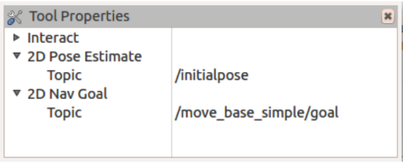

# 8.2.1 Навигация по точкам и щелчкам мыши в RViz

Мы также можем указать целевую позу с помощью мыши в RViz. Если вы запустили RViz с файлом nav.rviz, как описано выше, вам стоит пойти дальше. Однако просто для проверки, если вы не видите окно «Свойства инструмента» в правой части экрана RViz, щелкните меню «Панели» и выберите «Свойства инструмента». Должно появиться всплывающее окно, которое выглядит так:

В категории 2D Nav Goal тема должна быть указана как / Move\_base\_simple / goal. Если нет, введите название этой темы в поле сейчас.

Если вам нужно было внести какие-либо изменения, щелкните в RViz меню «Файл»  и выберите «Сохранить конфигурацию». Когда вы закончите, вы можете закрыть окно «Свойства инструмента», нажав маленький **х** в верхнем правом углу.

С этими предварительными сведениями теперь можно использовать мышь для перемещения робота. Нажмите кнопку «Сброс», чтобы очистить все оставшиеся стрелки одометрии. Затем нажмите кнопку 2D Nav Goal в верхней части экрана RViz. Затем нажмите и удерживайте мышь где-нибудь на сетке, где вы хотите, чтобы робот оказался в конечном итоге. Если вы слегка передвинете мышь, удерживая нажатой кнопку, появится большая зеленая стрелка. Поверните стрелку, чтобы обозначить целевую ориентацию робота. Теперь отпустите кнопку мыши, и move\_base должен направить робота к цели. Попробуйте установить несколько разных целей и наблюдайте за изменениями в глобальных и локальных путях. Как и в предыдущем разделе, вы также можете вызвать rqt\_reconfigure и изменить относительные значения параметров pdist\_scale и gdist\_scale, а также max\_vel\_x, чтобы изменить поведение локальных и глобальных путей.

Если вы посмотрите в окно терминала, где вы запустили RViz, вы увидите несколько сообщений \[INFO\], указывающих позы \(положение и ориентация\), которые вы установили с помощью мыши. Эта информация полезна, если вы когда-нибудь захотите записать определенный набор координат на карте и использовать их позже в качестве местоположения цели для робота, как мы увидим позже.

