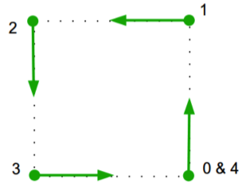
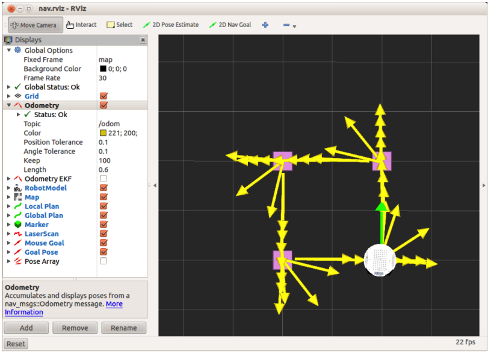

# 8.2.3 Навигация по квадрату с помощью move\_base

Теперь мы готовы перемещать нашего робота в квадрате, используя скорее move\_base, чем простые сообщения Twist. Скрипт move\_base\_square.py в подкаталоге узлов выполняет эту работу. Сценарий просто циклически проходит через четыре целевые позы, по одной для каждого угла квадрата. Четыре целевых положения показаны стрелками на рисунке ниже:



Помните, что «поза» в ROS означает и позицию, и ориентацию.

Чтобы убедиться, что мы начинаем с чистого листа, завершите все файлы запуска, использованные в предыдущем разделе, введя Ctrl-C в соответствующих окнах терминала. Затем запустите поддельные узлы TurtleBot и move\_base, как и раньше:

`$ roslaunch rbx1_bringup fake_turtlebot.launch`

И в другом терминале :

`$ roslaunch rbx1_nav fake_move_base_blank_map.launch`

Затем убедитесь, что у вас есть RViz с файлом конфигурации nav.rivz:

``$ rosrun rviz rviz -d `rospack find rbx1_nav`/nav.rviz``

Если у вас уже был запущен RViz, удалите все оставшиеся стрелки Odometry, нажав кнопку «Сброс».

Наконец, запустите скрипт move\_base\_square.py:

`$ rosrun rbx1_nav move_base_square.py`

По завершении сценариев RViz должен выглядеть следующим образом:



Небольшие квадраты указывают расположение четырех угловых точек, в которые мы хотим попасть. \(Первый квадрат скрыт под роботом на рисунке выше.\) Как вы видите, квадратная траектория не плохая, хотя все, что мы указали, это четыре угловых позы. Можно еще больше уточнить траекторию, изменив параметры конфигурации базового локального планировщика или установив промежуточные путевые точки между углами. Но настоящая цель move\_base состоит не в том, чтобы идти по точному пути, а в том, чтобы достичь произвольных целевых мест, избегая при этом препятствий. Следовательно, это дает возможность очень хорошо работать роботу в доме или в офисе, помогая ему не сталкиваться с вещами, это мы сможем увидеть в следующем разделе

Давайте посмотрим на код.

Ссылка на источник: [move\_base\_square.py](https://github.com/pirobot/rbx1/blob/indigo-devel/rbx1_nav/nodes/move_base_square.py)

```text
#!/usr/bin/env python

import rospy
import actionlib
from actionlib_msgs.msg import *
from geometry_msgs.msg import Pose, Point, Quaternion, Twist
from move_base_msgs.msg import MoveBaseAction, MoveBaseGoal
from tf.transformations import quaternion_from_euler
from visualization_msgs.msg import Marker
from math import radians, pi

class MoveBaseSquare():
    def __init__(self):
        rospy.init_node('nav_test', anonymous=False)
        
        rospy.on_shutdown(self.shutdown)
        
        # How big is the square we want the robot to navigate?
        square_size = rospy.get_param("~square_size", 1.0) # meters
        
        # Create a list to hold the target quaternions (orientations)
        quaternions = list()
        
        # First define the corner orientations as Euler angles
        euler_angles = (pi/2, pi, 3*pi/2, 0)
        
        # Then convert the angles to quaternions
        for angle in euler_angles:
            q_angle = quaternion_from_euler(0, 0, angle, axes='sxyz')
            q = Quaternion(*q_angle)
            quaternions.append(q)
        
        # Create a list to hold the waypoint poses
        waypoints = list()
        
        # Append each of the four waypoints to the list.  Each waypoint
        # is a pose consisting of a position and orientation in the map frame.
        waypoints.append(Pose(Point(square_size, 0.0, 0.0), quaternions[0]))
        waypoints.append(Pose(Point(square_size, square_size, 0.0), quaternions[1]))
        waypoints.append(Pose(Point(0.0, square_size, 0.0), quaternions[2]))
        waypoints.append(Pose(Point(0.0, 0.0, 0.0), quaternions[3]))
        
        # Initialize the visualization markers for RViz
        self.init_markers()
        
        # Set a visualization marker at each waypoint        
        for waypoint in waypoints:           
            p = Point()
            p = waypoint.position
            self.markers.points.append(p)
            
        # Publisher to manually control the robot (e.g. to stop it, queue_size=5)
        self.cmd_vel_pub = rospy.Publisher('cmd_vel', Twist, queue_size=5)
        
        # Subscribe to the move_base action server
        self.move_base = actionlib.SimpleActionClient("move_base", MoveBaseAction)
        
        rospy.loginfo("Waiting for move_base action server...")
        
        # Wait 60 seconds for the action server to become available
        self.move_base.wait_for_server(rospy.Duration(60))
        
        rospy.loginfo("Connected to move base server")
        rospy.loginfo("Starting navigation test")
        
        # Initialize a counter to track waypoints
        i = 0
        
        # Cycle through the four waypoints
        while i < 4 and not rospy.is_shutdown():
            # Update the marker display
            self.marker_pub.publish(self.markers)
            
            # Intialize the waypoint goal
            goal = MoveBaseGoal()
            
            # Use the map frame to define goal poses
            goal.target_pose.header.frame_id = 'map'
            
            # Set the time stamp to "now"
            goal.target_pose.header.stamp = rospy.Time.now()
            
            # Set the goal pose to the i-th waypoint
            goal.target_pose.pose = waypoints[i]
            
            # Start the robot moving toward the goal
            self.move(goal)
            
            i += 1
        
    def move(self, goal):
            # Send the goal pose to the MoveBaseAction server
            self.move_base.send_goal(goal)
            
            # Allow 1 minute to get there
            finished_within_time = self.move_base.wait_for_result(rospy.Duration(60)) 
            
            # If we don't get there in time, abort the goal
            if not finished_within_time:
                self.move_base.cancel_goal()
                rospy.loginfo("Timed out achieving goal")
            else:
                # We made it!
                state = self.move_base.get_state()
                if state == GoalStatus.SUCCEEDED:
                    rospy.loginfo("Goal succeeded!")
                    
    def init_markers(self):
        # Set up our waypoint markers
        marker_scale = 0.2
        marker_lifetime = 0 # 0 is forever
        marker_ns = 'waypoints'
        marker_id = 0
        marker_color = {'r': 1.0, 'g': 0.7, 'b': 1.0, 'a': 1.0}
        
        # Define a marker publisher.
        self.marker_pub = rospy.Publisher('waypoint_markers', Marker, queue_size=5)
        
        # Initialize the marker points list.
        self.markers = Marker()
        self.markers.ns = marker_ns
        self.markers.id = marker_id
        self.markers.type = Marker.CUBE_LIST
        self.markers.action = Marker.ADD
        self.markers.lifetime = rospy.Duration(marker_lifetime)
        self.markers.scale.x = marker_scale
        self.markers.scale.y = marker_scale
        self.markers.color.r = marker_color['r']
        self.markers.color.g = marker_color['g']
        self.markers.color.b = marker_color['b']
        self.markers.color.a = marker_color['a']
        
        self.markers.header.frame_id = 'odom'
        self.markers.header.stamp = rospy.Time.now()
        self.markers.points = list()

    def shutdown(self):
        rospy.loginfo("Stopping the robot...")
        # Cancel any active goals
        self.move_base.cancel_goal()
        rospy.sleep(2)
        # Stop the robot
        self.cmd_vel_pub.publish(Twist())
        rospy.sleep(1)

if __name__ == '__main__':
    try:
        MoveBaseSquare()
    except rospy.ROSInterruptException:
        rospy.loginfo("Navigation test finished.")

```

Давайте теперь рассмотрим ключевые строки сценария.

```text
# First define the corner orientations as Euler angles
        euler_angles = (pi/2, pi, 3*pi/2, 0)
        
# Then convert the angles to quaternions
        for angle in euler_angles:
            q_angle = quaternion_from_euler(0, 0, angle, axes='sxyz')
            q = Quaternion(*q_angle)
            quaternions.append(q)
```

Здесь мы определяем ориентацию цели в четырех углах квадрата, сначала как углы Эйлера, которые легче визуализировать на карте, а затем преобразуем в кватернионы.

```text
waypoints.append(Pose(Point(square_size, 0.0, 0.0), quaternions[0]))
        waypoints.append(Pose(Point(square_size, square_size, 0.0), quaternions[1]))
        waypoints.append(Pose(Point(0.0, square_size, 0.0), quaternions[2]))
        waypoints.append(Pose(Point(0.0, 0.0, 0.0), quaternions[3]))
```

Далее мы создаем четыре позиции путевых точек объединив вращения с координатами четырех углов.

```text
# Initialize the visualization markers for RViz
        self.init_markers()
        
# Set a visualization marker at each waypoint        
        for waypoint in waypoints:           
            p = Point()
            p = waypoint.position
            self.markers.points.append(p)
```

Хотя это не рассматривается в этом томе, установка маркеров визуализации в RViz довольно проста, и [здесь можно найти](https://wiki.ros.org/rviz/Tutorials) ряд существующих учебных пособий. Скрипт помещает красный квадрат в каждый целевой угол, а функция self.init\_markers \(\), определенная в конце скрипта, устанавливает формы, размеры и цвета маркера. Затем мы добавляем четыре маркера в список для последующего использования.

```text
 self.move_base = actionlib.SimpleActionClient("move_base", MoveBaseAction)
```

Здесь мы определяем SimpleActionClient, который будет отправлять цели на сервер действий move\_base.

```text
self.move_base.wait_for_server(rospy.Duration(60))
```


Прежде чем мы сможем начать отправку целей, нам нужно дождаться, пока сервер действий move\_base станет доступным. Мы даем 60 секунд до истечения времени ожидания.

```text
# Cycle through the four waypoints
        while i < 4 and not rospy.is_shutdown():
# Update the marker display
            self.marker_pub.publish(self.markers)
            
 # Intialize the waypoint goal
            goal = MoveBaseGoal()
            
 # Use the map frame to define goal poses
            goal.target_pose.header.frame_id = 'map'
            
 # Set the time stamp to "now"
            goal.target_pose.header.stamp = rospy.Time.now()
            
 # Set the goal pose to the i-th waypoint
            goal.target_pose.pose = waypoints[i]
            
 # Start the robot moving toward the goal
            self.move(goal)
            
            i += 1
```


  
Затем мы входим в наш основной цикл, циклически проходя через каждую из четырех путевых точек. Сначала мы публикуем маркеры для обозначения четырех поз. \(Это нужно делать в каждом цикле, чтобы они оставались видимыми на протяжении всего движения.\) Затем мы инициализируем переменную цели как тип действия MoveBaseGoal. Затем мы устанавливаем цель frame\_id для фрейма карты и метку времени для текущего времени. Наконец, мы устанавливаем целевую позицию для текущей путевой точки и отправляем цель на сервер действий move\_base с помощью вспомогательной функции move \(\), которую мы опишем далее.

```text
def move(self, goal):
# Send the goal pose to the MoveBaseAction server
            self.move_base.send_goal(goal)
            
# Allow 1 minute to get there
            finished_within_time = self.move_base.wait_for_result(rospy.Duration(60)) 
            
# If we don't get there in time, abort the goal
            if not finished_within_time:
                self.move_base.cancel_goal()
                rospy.loginfo("Timed out achieving goal")
            else:
 # We made it!
                state = self.move_base.get_state()
                if state == GoalStatus.SUCCEEDED:
                    rospy.loginfo("Goal succeeded!")
```

Вспомогательная функция move \(\) принимает цель в качестве входных данных, отправляет ее на сервер MoveBaseAction, затем ждет в течение 60 секунд, пока робот не доберется до нее. Затем на экране отображается сообщение об успехе или сбое. Обратите внимание, насколько проще этот подход к кодированию, чем наш предыдущий сценарий nav\_square.py, который использовал сообщения Twist напрямую. В частности, нам больше не нужно непосредственно отслеживать данные одометрии. Вместо этого сервер move\_base action заботится о нем для нас.

