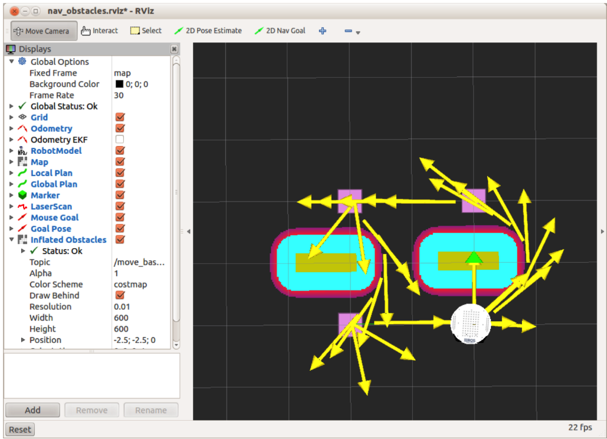

# 8.2.4. Избегание имитируемых препятствий

Одной из наиболее мощных функций move\_base является возможность избегать препятствий,  достигая цели. Препятствия могут быть статической частью текущей карты \(например, стены\) или они могут появляться динамически, например, когда кто-то идет перед роботом. Базовый локальный планировщик может немедленно пересчитать путь робота , чтобы уберечь его от ударов по объектам и в то же время позволить ему достичь места назначения.

Чтобы проиллюстрировать процесс, загрузим новую карту с парой препятствий на пути робота. Затем мы снова запустим скрипт move\_base\_square.py, чтобы увидеть, сможет ли базовый локальный планировщик найти путь вокруг препятствий и все же направить робота к четырем целям.

Сначала завершите работу любых фальшивых роботов, которые у вас еще могут быть запущены, а также более ранний файл fake\_move\_base\_blank\_map.launch, набрав Ctrl-C в соответствующих окнах терминала. Затем выполните следующие команды:

`$ roslaunch rbx1_bringup fake_turtlebot.launch`

Далее :

`$ rosparam delete /move_base`

Эта команда очищает все существующие параметры move\_base, что менее радикально, чем уничтожение и повторный запуск roscore. Вы также можете использовать аргумент clear\_params = "true" в файле запуска move\_base, чтобы выполнить то же самое, и это делается в файле fake\_move\_base\_obstacles.launch, который вызывается файлом запуска, который вызываетсяя следующей командой:

`$ roslaunch rbx1_nav fake_move_base_map_with_obstacles.launch`

Эта команда вызывает узел move\_base вместе с картой с парой препятствий возле центра.

Если вы уже используете RViz, закройте его и запустите снова с помощью файла конфигурации nav\_obstacles.rviz:

``$ rosrun rviz rviz -d `rospack find rbx1_nav`/nav_obstacles.rviz``

Когда узел move\_base открыт и вы видите препятствия в RViz, нажмите кнопку «Сброс», чтобы обновить отображение, а затем запустите сценарий move\_base\_square.py:



`$ rosrun rbx1_nav move_base_square.py`

Когда скрипт завершится, представление в RViz должно выглядеть примерно так:

Препятствия представлены горизонтальными желтыми полосами, в то время как разноцветные овальные области вокруг препятствий отражают радиус инфляции \(0,2 метра\), который мы установили для обеспечения безопасного буфера. Как вы можете видеть, симулированный робот без труда доберется до места цели, избегая препятствий. Более того, по пути к третьему углу квадрата \(слева внизу\) базовый планировщик выбрал более короткий маршрут между двумя препятствиями, а не обходил его снаружи.

Во время симуляции вы заметите тонкую зеленую линию, которая указывает глобальный путь, запланированный для следующей цели цели. Более короткая красная линия, которая появляется перед роботом, - это локальный путь, который может быстрее адаптироваться к местным условиям. Поскольку мы не моделируем никаких датчиков, робот фактически работает вслепую и полагается только на статическую карту и ее \(поддельные\) одометрию.

Чтобы обойти робота вокруг этих тесно расположенных препятствий, необходимо было изменить несколько параметров навигации по сравнению со значениями, которые мы использовали с пустой картой. Если вы посмотрите на файл запуска fake\_move\_base\_map\_with\_obstacles.launch в

В каталоге rbx1\_nav / launch вы увидите, что он вызывает узел move\_base, включая дополнительный файл запуска fake\_move\_base\_obstacles.launch. Этот файл практически идентичен файлу запуска fake\_move\_base.launch, который мы использовали в предыдущем разделе, за исключением того, что мы добавили строку, которая переопределяет некоторые параметры навигации. Файл запуска выглядит так:

```text
<launch>
<node pkg="move_base" type="move_base" respawn="false" name="move_base"
output="screen">
<rosparam file="$(find rbx1_nav)/config/fake/costmap_common_params.yaml"
command="load" ns="global_costmap" />
<rosparam file="$(find rbx1_nav)/config/fake/costmap_common_params.yaml"
command="load" ns="local_costmap" />
<rosparam file="$(find rbx1_nav)/config/fake/local_costmap_params.yaml"
command="load" />
<rosparam file="$(find rbx1_nav)/config/fake/global_costmap_params.yaml"
command="load" />
<rosparam file="$(find rbx1_nav)/config/fake/base_local_planner_params.yaml"
command="load" />
<rosparam file="$(find rbx1_nav)/config/nav_obstacles_params.yaml"
command="load" />
</node>
</launch>
```

Ключевая строка выделена полужирным шрифтом и загружает файл параметров nav\_obstacles\_params.yaml. Этот файл в свою очередь выглядит следующим образом:

```text
TrajectoryPlannerROS:
max_vel_x: 0.3
pdist_scale: 0.8
gdist_scale: 0.4
```

Как видите, файл содержит несколько параметров, которые мы использовали в файле base\_local\_planner\_params.yaml, но устанавливает для них значения, которые лучше работают для избежания препятствий. В частности, мы замедлили максимальную скорость с 0,5 м / с до 0,3 м / с и изменили относительную значимость на pdist\_scale и gdist\_scale, чтобы теперь мы придавали большую значимость следованию запланированному пути. Мы могли бы просто создать совершенно новый base\_local\_planner\_params.yaml с этими несколькими изменениями, но таким образом мы можем сохранить большую часть наших параметров в главном файле и просто переопределить их по мере необходимости с помощью специальных файловых «фрагментов», как тот, который используется здесь.

