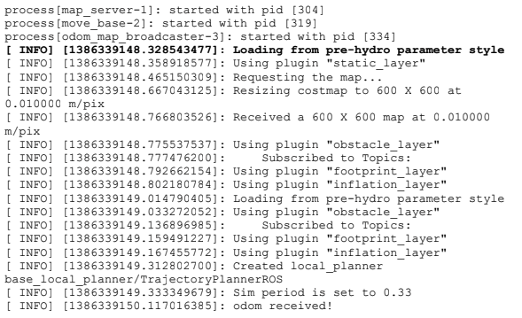
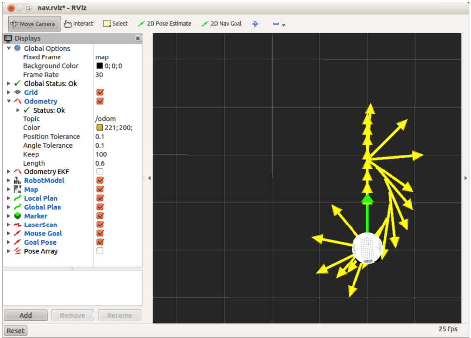

# 8.2 Тестирование move\_base в симуляторе ArbotiX

Узлу move\_base требуется карта среды, но карта может быть просто пустым квадратом, если мы просто хотим протестировать интерфейс действия move\_base. Мы узнаем, как создавать и использовать реальные карты в следующем разделе. Пакет rbx1\_nav содержит пустую карту с именем blank\_map.pgm в подкаталоге maps, и его соответствующий файл описания - blank\_map.yaml. Файл запуска для вызова узла move\_base и пустой карты называется fake\_move\_base\_blank\_map.launch в подкаталоге запуска. Давайте посмотрим на него :

```text
<launch>
<!-- Run the map server with a blank map -->
<node name="map_server" pkg="map_server" type="map_server" args="$(find
rbx1_nav)/maps/blank_map.yaml"/>
<!-- Launch move_base and load all navigation parameters -->
<include file="$(find rbx1_nav)/launch/fake_move_base.launch" />
<!-- Run a static transform between /odom and /map -->
<node pkg="tf" type="static_transform_publisher" name="odom_map_broadcaster"
args="0 0 0 0 0 0 /odom /map 100" />
</launch>
```

Комментарии в файле запуска помогают нам понять, что происходит. Сначала мы запускаем узел ROS map\_server с пустой картой. Обратите внимание, как карта указана в ее файле .yaml, который описывает размер и разрешение самой карты. Затем мы включаем файл fake\_move\_base.launch \(описанный ниже\), который запускает узел move\_base и загружает все необходимые параметры конфигурации, которые хорошо работают в симуляторе подделки. Наконец, поскольку мы используем пустую карту, а наш моделируемый робот не имеет датчиков, робот не может использовать данные сканирования для локализации. Вместо этого мы просто устанавливаем статическое преобразование идентичности, чтобы привязать кадр одометрии робота к кадру карты, что, по сути, предполагает идеальную одометрию.

Давайте теперь посмотрим на файл fake\_move\_base.launch:

```text
<launch>
<node pkg="move_base" type="move_base" respawn="false" name="move_base"
output="screen">
<rosparam file="$(find rbx1_nav)/config/fake/costmap_common_params.yaml"
command="load" ns="global_costmap" />
<rosparam file="$(find rbx1_nav)/config/fake/costmap_common_params.yaml"
command="load" ns="local_costmap" />
<rosparam file="$(find rbx1_nav)/config/fake/local_costmap_params.yaml"
command="load" />
<rosparam file="$(find rbx1_nav)/config/fake/global_costmap_params.yaml"
command="load" />
<rosparam file="$(find rbx1_nav)/config/fake/base_local_planner_params.yaml"
command="load" />
</node>
</launch>
```

Файл запускает узел move\_base с пятью вызовами rosparam для загрузки файлов параметров, которые мы описали ранее. Причина, по которой мы дважды загружаем файл costmap\_common\_params.yaml, заключается в установке этих общих параметров как в пространстве имен global\_costmap, так и в пространстве имен local\_costmap. Это выполняется с использованием соответствующего атрибута «ns» в каждой строке.

Чтобы попробовать это в симуляции, сначала запустите симулятор ArbotiX:

`$ roslaunch rbx1_bringup fake_turtlebot.launch`

\(Замените своим любимым "фальшивым" роботом.\)

Чтобы запустить узел move\_base вместе с пустой картой, выполните команду:

`$ roslaunch rbx1_nav fake_move_base_blank_map.launch`

Вы должны увидеть серию сообщений, похожих на:




  
&lt;!--
  
 /\* Font Definitions \*/
  
 @font-face
  
	{font-family:"Cambria Math";
  
	panose-1:2 4 5 3 5 4 6 3 2 4;
  
	mso-font-charset:0;
  
	mso-generic-font-family:roman;
  
	mso-font-pitch:variable;
  
	mso-font-signature:3 0 0 0 1 0;}
  
@font-face
  
	{font-family:Calibri;
  
	panose-1:2 15 5 2 2 2 4 3 2 4;
  
	mso-font-charset:0;
  
	mso-generic-font-family:swiss;
  
	mso-font-pitch:variable;
  
	mso-font-signature:-536859905 -1073732485 9 0 511 0;}
  
 /\* Style Definitions \*/
  
 p.MsoNormal, li.MsoNormal, div.MsoNormal
  
	{mso-style-unhide:no;
  
	mso-style-qformat:yes;
  
	mso-style-parent:"";
  
	margin:0cm;
  
	margin-bottom:.0001pt;
  
	mso-pagination:widow-orphan;
  
	font-size:12.0pt;
  
	font-family:"Calibri",sans-serif;
  
	mso-ascii-font-family:Calibri;
  
	mso-ascii-theme-font:minor-latin;
  
	mso-fareast-font-family:Calibri;
  
	mso-fareast-theme-font:minor-latin;
  
	mso-hansi-font-family:Calibri;
  
	mso-hansi-theme-font:minor-latin;
  
	mso-bidi-font-family:"Times New Roman";
  
	mso-bidi-theme-font:minor-bidi;
  
	mso-fareast-language:EN-US;}
  
.MsoChpDefault
  
	{mso-style-type:export-only;
  
	mso-default-props:yes;
  
	font-family:"Calibri",sans-serif;
  
	mso-ascii-font-family:Calibri;
  
	mso-ascii-theme-font:minor-latin;
  
	mso-fareast-font-family:Calibri;
  
	mso-fareast-theme-font:minor-latin;
  
	mso-hansi-font-family:Calibri;
  
	mso-hansi-theme-font:minor-latin;
  
	mso-bidi-font-family:"Times New Roman";
  
	mso-bidi-theme-font:minor-bidi;
  
	mso-fareast-language:EN-US;}
  
@page WordSection1
  
	{size:612.0pt 792.0pt;
  
	margin:2.0cm 42.5pt 2.0cm 3.0cm;
  
	mso-header-margin:36.0pt;
  
	mso-footer-margin:36.0pt;
  
	mso-paper-source:0;}
  
div.WordSection1
  
	{page:WordSection1;}
  
--&gt;
  


Строка, выделенная жирным шрифтом выше, указывает на то, что в наших файлах параметров не используется новая функция многоуровневой карты затрат, доступная начиная с Hydro. Поскольку на данный момент нам не нужна многоуровневая карта затрат, мы можем использовать те же файлы параметров, что и в предыдущих выпусках, и move\_base будет работать в режиме обратной совместимости.

Если вы еще не используете RViz, запустите его сейчас с помощью прилагаемого файла конфигурации навигации:

``$ rosrun rviz rviz -d `rospack find rbx1_nav`/nav.rviz``

Теперь мы готовы контролировать движение робота, используя действия move\_base, а не простые сообщения Twist. Чтобы проверить это, давайте переместим робота на 1,0 метра прямо вперед. Поскольку наш робот начинает с координат \(0, 0, 0\) как во фрейме / map, так и в / base\_link, мы могли бы использовать любой фрейм для указания первого движения. Однако, поскольку первое движение не приведет робота к точному положению и ориентации цели, последующие цели относительно фрейма / base\_link начнут накапливать ошибку. По этой причине лучше установить наши цели относительно статического фрейма / фрейма карты. Ссылаясь на синтаксис сообщения цели move\_base, приведенный ранее, нам нужна команда:

`$ rostopic pub /move_base_simple/goal geometry_msgs/PoseStamped \'{ header: { frame_id: "map" }, pose: { position: { x: 1.0, y: 0, z: 0 }, orientation: { x: 0, y: 0, z: 0, w: 1 } } }'`

Вы должны увидеть, как робот движется на 1 метр вперед в RViz. \(Большая зеленая стрелка, которая появляется, представляет собой целевую позу.\) Обратите внимание, что ориентация в приведенной выше команде указана как кватернион, а кватернион с компонентами \(0, 0, 0, 1\) задает поворот идентификатора.

Чтобы переместить робота обратно в начальную точку, сначала нажмите Ctrl-C, чтобы завершить предыдущую команду. Затем отправьте координаты \(0, 0, 0\) во фрейме карты, когда робот направлен вверх:

`$ rostopic pub /move_base_simple/goal geometry_msgs/PoseStamped \'{ header: { frame_id: "map" }, pose: { position: { x: 0, y: 0, z: 0 }, orientation: { x: 0, y: 0, z: 0, w: 1 } } }'`

Вид в RViz после обеих команд должен выглядеть примерно следующим образом:



\(Примечание: робот может совершить обратный путь, повернув налево, а не налево, как показано выше. Это немного монетный бросок в зависимости от точной ориентации робота в первом месте цели.\) Когда робот движется, тонкая зеленая линия \(которую может быть трудно или невозможно увидеть, если отображаются стрелки Odometry\) указывает глобальный путь, запланированный для робота от начальной позиции к цели. Более короткая красная линия - это локально планируемая траектория, которая обновляется чаще по мере продвижения робота к месту назначения.

Отображение глобального и локального путей можно отключить и включить с помощью флажков рядом с соответствующими дисплеями на панели «Дисплей» слева в RViz. Вы также можете изменить цвета путей, используя соответствующее значение свойства для каждого отображения. Чтобы более четко увидеть глобальные и локальные пути, отключите дисплеи для «Одометрия», «Положение цели» и «Поза мыши», а затем снова запустите две команды move\_base, описанные выше.

Заметим, что локальная траектория в этом случае следует дуге, которая находится довольно далеко от глобального пути прямой линии. Отчасти это связано с тем, что на карте нет препятствий, поэтому планировщик выбирает приятную плавную траекторию поворота. Это также отражает наш выбор двух параметров: pdist\_scale \(0.4\) и gdist\_scale \(0.8\) и max linear скорость робота \(max\_vel\_x\). Чтобы робот следовал по глобальному пути более близко, мы можем использовать rqt\_reconfigure для динамического увеличения параметра pdist\_scale \(или уменьшения max\_vel\_x\) без необходимости перезапуска всех работающих узлов.

Чтобы попробовать это, откройте другое окно терминала и вызовите rqt\_reconfigure:

`$ rosrun rqt_reconfigure rqt_reconfigure`

Затем откройте группу move\_base и выберите узел TrajectoryPlannerROS, затем установите для параметра pdist\_scale значение, более высокое, например 0,8, и уменьшите значение gdist\_scale до 0,4. Затем выключите стрелки одометрии в RViz \(если они все еще включены\) и снова выполните две команды move\_base, чтобы увидеть эффект. Вы должны увидеть, что робот теперь более точно следует глобальному запланированному пути \(зеленому\).

