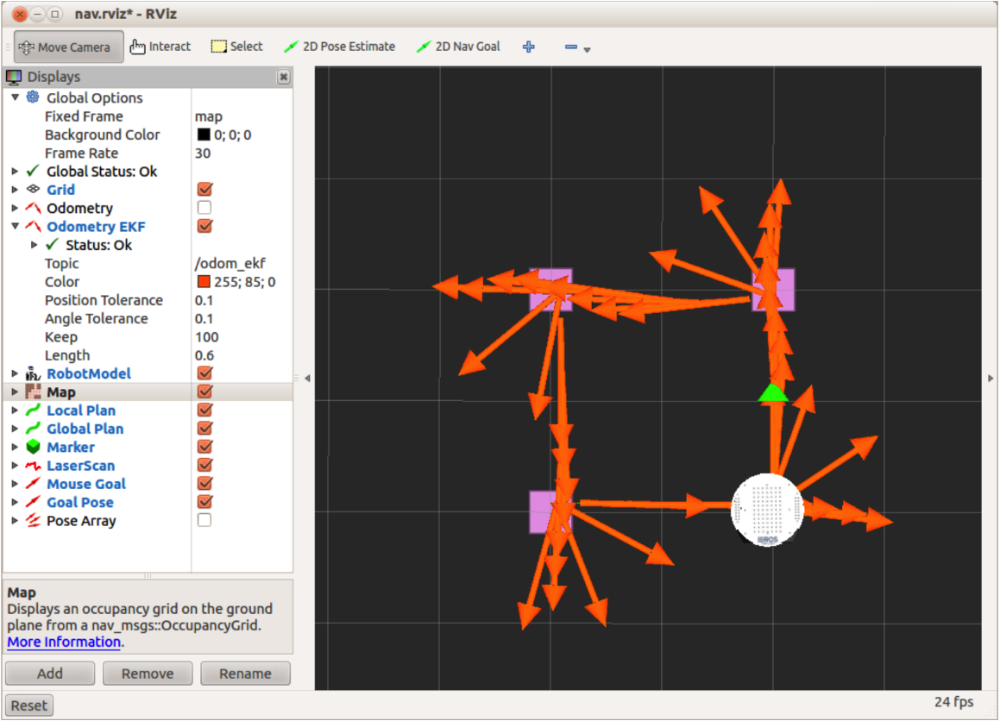

# 8.3.1. Тестирование move\_base без препятствий

Чтобы убедиться, что мы работаем с чистого листа, Ctrl-C из всех запущенных файлов запуска ROS или узлов, включая roscore. Затем снова запустите roscore и подготовьте своего робота.

Убедитесь, что у вашего робота достаточно места, чтобы обвести квадрат \(вы можете сократить стороны в скрипте, если хотите\). Когда вы будете готовы, запустите необходимые файлы запуска для подключения к вашему роботу. Для оригинального TurtleBot \(используя базу iRobot Create\). Запустите:

`$ roslaunch rbx1_bringup turtlebot_minimal_create.launch`

\(Или используйте свой собственный файл запуска, если вы создали его для хранения параметров калибровки.\)

Если вы используете TurtleBot, вы также можете запустить сценарий odom\_ekf.py, чтобы увидеть комбинированную рамку одометрии TurtleBot в RViz. Вы можете пропустить это, если вы не используете TurtleBot. Этот файл запуска должен быть запущен на ноутбуке TurtleBot:

`$ roslaunch rbx1_bringup odom_ekf.launch`

Затем запустите узел move\_base с пустой картой. ПРИМЕЧАНИЕ. Это файл запуска, отличный от того, который мы использовали для смоделированного робота. Этот конкретный файл запуска загружает набор параметров навигации, которые должны довольно хорошо работать с оригинальным TurtleBot.

`$ roslaunch rbx1_nav tb_move_base_blank_map.launch`

Теперь запустите RViz на своей рабочей станции с файлом конфигурации nav. Возможно, вы захотите запустить это на своем настольном компьютере, а не на ноутбуке TurtleBot:

``$ rosrun rviz rviz -d `rospack find rbx1_nav`/nav.rviz``

Наконец, запустите сценарий move\_base\_square.py. Вы можете запустить это либо на ноутбуке робота или на рабочем столе:

`$ rosrun rbx1_nav move_base_square.py`

Если все идет хорошо, ваш робот должен переместиться из одного угла квадрата в другой, а затем остановиться, когда вернется к началу. На следующем рисунке показан результат при запуске моего TurtleBot .

В реальном мире робот находился в пределах 27 см от стартовой позиции и примерно в 5 градусах не по центру.

