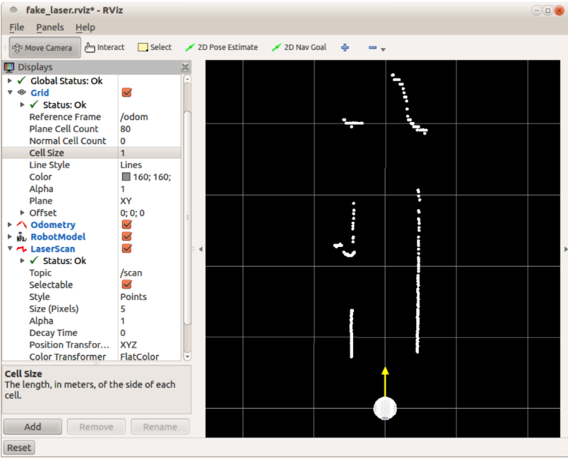

# 8.4.1 Лазерный сканер или встроенная камера?

Чтобы использовать gmapping, нашему роботу требуется либо лазерный сканер, либо встроенная камера , например Kinect или Xtion. Если у вас есть лазерный сканер, вам понадобятся лазерные драйверы ROS, которые вы можете установить, используя:

`$ sudo apt-get install ros-indigo-laser-* ros-indigo-hokuyo-node`

В этом случае файлы запуска вашего робота должны будут запустить драйвера для вашего конкретного сканера. Например, Pi Robot использует лазерный сканер Hokuyo, и соответствующий файл запуска выглядит следующим образом:

```text
<launch>
<node name="hokuyo" pkg="hokuyo_node" type="hokuyo_node">
<param name="min_ang" value="-1.7" />
<param name="max_ang" value="1.7" />
<param name="hokuyo_node/calibrate_time" value="true" />
<param name="frame_id" value="/base_laser" />
</node>
</launch>
```

Вы можете найти файл hokuyo.launch в подкаталоге rbx1\_bringup / launch. Если у вас нет лазерного сканера, но у вас есть встроенная камера, такая как Kinect или Xtion, вы можете использовать «поддельный лазерный сканер», как описано в предыдущем разделе. 

Обратите внимание, что поддельное лазерное сканирование довольно узкое - около 57 градусов - что является шириной поля зрения Kinect или Xtion. Типичный лазерный сканер имеет ширину около 240 градусов и более. Тем не менее, поддельное сканирование может быть использовано для создания довольно хороших карт. 

Чтобы попробовать поддельный лазерный сканер на оригинальной TurtleBot, войдите в ноутбук робота и запустите:

`$ roslaunch rbx1_bringup turtlebot_minimal_create.launch`

Затем откройте другое окно терминала и войдите в ноутбук TurtleBot \(или компьютер, подключенный к вашей встроенной камере\) и запустите один из следующих файлов запуска искусственного лазера. Эти файлы сначала запускают либо драйвер freenect, либо openni2 для камеры, а затем вызывают  deepimage\_to\_laserscan, который использует данные  из камеры для генерации сообщения лазерного сканирования  / scan. 

Если ваш Turtlebot использует Microsoft Kinect, используйте файл запуска freenect fake laser:

`$ roslaunch rbx1_bringup turtlebot_fake_laser_openni2.launch` 

Вернитесь к своей рабочей станции, откройте RViz с подключенным файлом конфигурации fake\_laser:

`$ rosrun rviz rviz -d rospack find rbx1_nav/fake_laser.rviz`

В случае, если вы все правильно выполнили, RViz будет выглядеть так:



На этом снимке экрана мы видим робота, который находится в коридоре с открытыми дверными проемами слева и справа, еще одна открытая дверь в конце коридора и открытое пространство слева . Линии сетки находятся на расстоянии 1 метра. Обратите внимание, что мы написали / scan  в  Topic в разделе Laser Scan Display. Если вы не видите точки сканирования, щелкните поле Topic и убедитесь, что сканирование публикуется и отображается на вашей рабочей станции.

