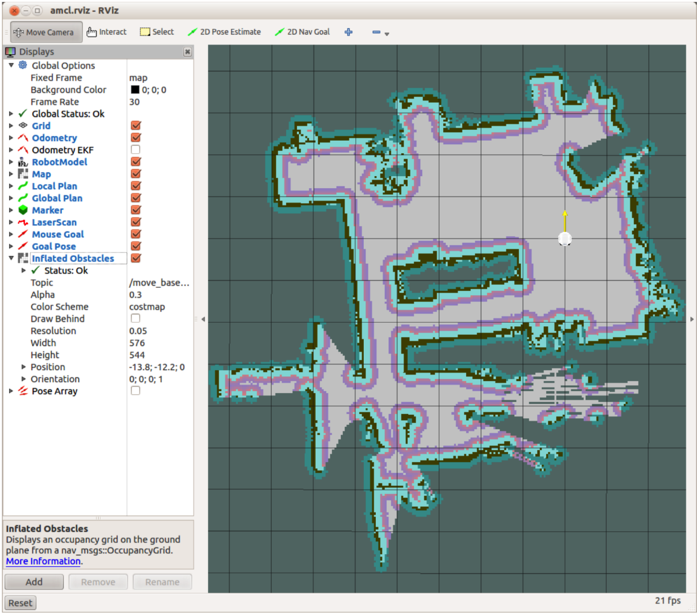

# 8.5.1 Тестирование amcl с искусственной локализацией

Ознакомьтесь с файлом запуска с именем fake\_amcl.launch в каталоге rbx1\_nav / launch:

```text
<launch>
<param name="use_sim_time" value="false" />
<!-- Set the name of the map yaml file: can be overridden on the command line.
-->
<arg name="map" default="test_map.yaml" />
<!-- Run the map server with the desired map -->
<node name="map_server" pkg="map_server" type="map_server" args="$(find
rbx1_nav)/maps/$(arg map)"/>
<!-- The move_base node -->
<include file="$(find rbx1_nav)/launch/fake_move_base.launch" />
<!-- Run fake localization compatible with AMCL output -->
<node pkg="fake_localization" type="fake_localization"
name="fake_localization" output="screen" />
<!-- For fake localization we need a static transforms between /odom and /map
and /map and /world -->
<node pkg="tf" type="static_transform_publisher" name="odom_map_broadcaster"
args="0 0 0 0 0 0 /odom /map 100" />
</launch>
```

Как видно из файла запуска, сначала мы загружаем карту на картографический сервер, в данном случае тестовую карту одноэтажного дома. Имя карты может быть изменено в командной строке, как мы увидим ниже. Кроме того, вы можете отредактировать файл запуска и изменить имя файла вашей карты, поэтому вам не нужно вводить его в командной строке. Далее мы включаем тот же файл fake\_move\_base.launch, который мы использовали ранее. Наконец, мы запускаем fake\_localization. Как вы можете прочитать на ROS Wiki странице,  [fake\_localization](http://wiki.ros.org/fake_localization) просто повторно публикует данные одометрии робота в форме, совместимой с amcl. 

Чтобы проверить все это в симуляторе ArbotiX, выполните следующие команды - завершите все команды, которые вы уже выполняли в различных терминалах:

`$ roslaunch rbx1_bringup fake_turtlebot.launch`

\(Замените своим любимым искусственным роботом, если хотите.\) 

Затем запустите файл fake\_amcl.launch с подключенной тестовой картой или укажите его на вашей собственной карте в командной строке:

`$ roslaunch rbx1_nav fake_amcl.launch map:=test_map.yaml`

Наконец, откройте RViz с файлом конфигурации amcl:

`$ rosrun rviz rviz -d rospack find rbx1_nav/amcl.rviz`

Как только карта появится в RViz, используйте правую кнопку мыши или колесико прокрутки для увеличения или уменьшения масштаба, а левую кнопку мыши - для панорамирования \(нажатие клавиши shift\) или вращения \(щелчок\). Если вы используете тестовую карту, изображение должно выглядеть примерно так:



Когда перед вами вид, который вам нравится, нажмите на кнопку 2D Nav Goal, затем выберите цель для робота на карте. Как только вы отпустите кнопку мыши, Move\_base приступит к перемещению робота к цели. Попробуйте несколько разных целей, чтобы увидеть, как amcl и move\_base работают вместе, чтобы спланировать и реализовать путь для робота.

