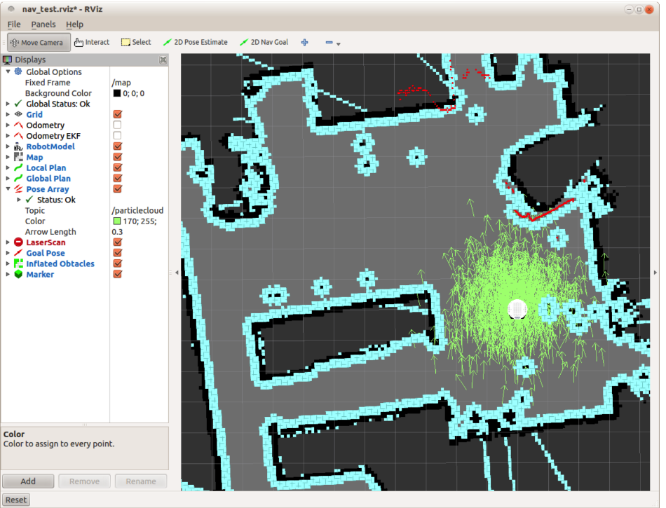
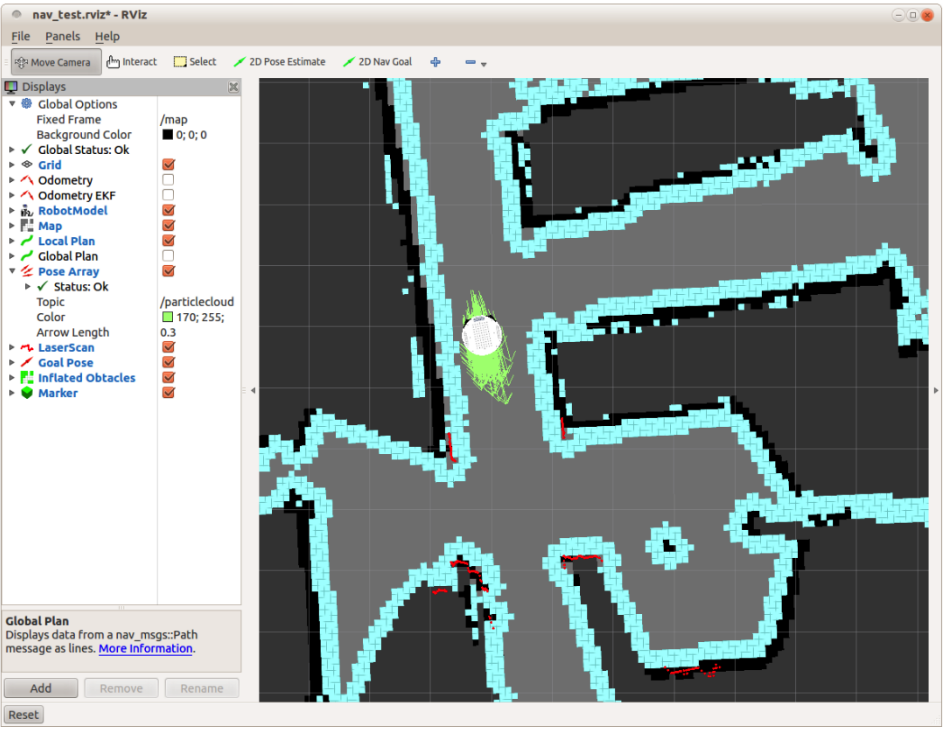

# 8.5.2 Использование amcl с реальным роботом

Если у вашего робота есть лазерный сканер или RGB-D камера, такая как Kinect или Xtion, вы можете попробовать amcl в реальном мире. Предполагая, что вы уже создали карту my\_map.yaml в каталоге rbx1\_nav / maps, выполните следующие шаги, чтобы начать локализацию вашего робота. 

Во-первых, прекратите работу любых искусственных роботов, а также файл fake\_amcl.launch, если вы запускали его в предыдущем разделе. Также неплохо было бы закрыть и перезапустить процесс roscore, чтобы убедиться, что мы начинаем с чистого листа. 

Если у вас есть TurtleBot, вы можете ознакомиться с официальным [руководством по SLAM для TurtleBot](https://wiki.ros.org/turtlebot_navigation/Tutorials/Autonomously%20navigate%20in%20a%20known%20map) в ROS Wiki. Вы также можете продолжить изучение здесь и получить по сути тот же результат.

Начните с запуска launch файлов вашего робота. Для оригинального TurtleBot вы должны запустить следующее на портативном компьютере робота:

`$ roslaunch rbx1_bringup turtlebot_minimal_create.launch`

\(Или используйте свой собственный файл запуска, если вы сохранили параметры калибровки в другом файле.\)

 Затем запустите искусственный лазер. \(Если у вас есть настоящий лазерный сканер, запустите его launch файл .\) Войдите в систему робота в другом терминале и запустите один из следующих launch файлов . Если ваш Turtlebot использует Microsoft Kinect, используйте файл запуска freenect fake laser:

`$ roslaunch rbx1_bringup turtlebot_fake_laser_freenect.launch`

Если ваш TurtleBot использует камеру Asus Xtion, Xtion Pro или Primesense 1.08 / 1.09, используйте версию openni2 следующим образом:

`$ roslaunch rbx1_bringup turtlebot_fake_laser_openni2.launch`

Теперь запустите файл tb\_demo\_amcl.launch с вашей картой в качестве аргумента:

`$ roslaunch rbx1_nav tb_demo_amcl.launch map:=my_map.yaml`

Наконец, запустите RViz с подключенным файлом конфигурации тестирования навигации:

`$ rosrun rviz rviz -d rospack find rbx1_nav/nav_test.rviz`

Когда amcl запускается впервые, вы должны задать ему начальную позу \(положение и ориентацию\) робота, поскольку amcl не может понять это самостоятельно. Чтобы установить начальную позу, сначала нажмите на кнопку 2D Pose Estimate в RViz. Затем нажмите на точку в карте, где ,как вы знаете, находится ваш робот. Удерживайте кнопку мыши, и должна будет появиться большая зеленая стрелка. Переместите мышь, чтобы направить стрелку в соответствии с ориентацией вашего робота, затем отпустите кнопку мыши.

 Установив начальную позицию своего робота, вы сможете использовать кнопку 2D Nav Goal в RViz, чтобы указывать цели навигации для своего робота в разных местах на карте. Используйте колесо прокрутки мыши, чтобы уменьшить или увеличить при необходимости. Когда робот движется, вы должны увидеть, что точки лазерного сканирования выровнены со стенами и границами препятствий. 

Вероятно, первое, что вы заметите в RViz, это облако светло-зеленых стрелок, окружающих робота. Эти стрелки представляют диапазон поз, возвращаемых amcl, и отображаются, потому что файл конфигурации nav\_test, который мы используем с RViz, включает тип отображения **Pose Array**. \(Посмотрите чуть ниже дисплея **GlobalPlan** на левой панели в RViz.\) Topic **Pose Array** установлен на topic /iclecloud, который является topic по умолчанию, в которой amcl публикует свои вычисления поз для робота. \(См. [amcl Wiki page](http://wiki.ros.org/amcl#Published_Topics).\) По мере того, как робот перемещается по среде, это облако должно уменьшаться в размере, поскольку дополнительные данные сканирования позволяют amcl уточнить положение и ориентацию робота.

 Вот несколько скриншотов из реального тестирования. Первый скриншот был взят сразу после начала испытаний, а второй - после того, как робот несколько минут перемещался по окружающей его среде: 

Обратите внимание, как массив поз на первом изображении достаточно растянут, в то время как на втором изображении массив сжался вокруг робота. На данный момент в тесте, робот достаточно уверен в положении, где он находится на карте. 

Чтобы протестировать препятствие на пути, направьте робота к цели на некотором расстоянии от него, затем идите впереди робота, когда он движется. Базовый местный планировщик должен направить робота вокруг вас, а затем продолжить путь к месту назначения.

 Вы также можете дистанционно управлять роботом в любое время, когда работает amcl, если вы запускаете  телеуправление с помощью клавиатуры или джойстика.

